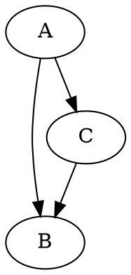

<script static>
layout = 'post.html'
title = 'Visualizing Algorithms'
date = '2018-02-12 8:00:00 -0400'
categories = ["notes", "javascript"]
description = "Using some custom code to generate interesting graphs of algorithmic operations."
image = "/img/sha/preview.png"
permalink = "/2018/02/12/visualizing-algorithms"
</script>

## Introduction

<h1>{{title}} ({{permalink}})</h1>
I recently  <a href="https://twitter.com/richinfante/status/959984976090619904">shared this on twitter</a>, and wanted to share a bit more about how I did it:

<blockquote class="twitter-tweet" data-lang="en"><p lang="en" dir="ltr">Different portions of the sha-256 algorithm (two rounds), visualized bit-by-bit as a directed graph (first ~30k, ~100k nodes, last ~100k nodes). A result of one of my recent experiments! <a href="https://t.co/cK2dLj9haT">pic.twitter.com/cK2dLj9haT</a></p>&mdash; <a href="https://twitter.com/richinfante/status/959984976090619904">Rich Infante (@richinfante) February 4, 2018</a></blockquote>

<div class="image-wrapper">
  <div class="image">
    
    <label>A random sample of 1000 or so bitwise ops</label>
  </div>
</div>

## Background

I'm not quite ready to open source the code yet since it lacks polish, but I'd like to explain a little about how it works and share a few interesting snippets from it. Essentially, I created a library that symbolically solves everything, at relatively small (but noticeable) performance cost. It's written in javascript which I chose since it was the most forgiving and many parts of my early prototypes relied on its more-or-less non-existent type system. Using a lower-level language like C would probably alleviate some of the cost, but performance is not so much of a problem that a rewrite would be beneficial. The initial algorithm I chose to analyze was sha-256 which I chose because it's a hash algorithm so the internal structure would (hopefully) look cool. I eventually ended up using `sha256(sha256(x))` as the function with hopes that it'd produce something interesting.

The library symbolically solves everything in terms of individual bits. This generates a rather large amount of data, but can theoretically be changed to more manageable operations like addition, subtraction, etc... Below is a snippet from my testing suite to illustrate what I mean:

```js
tap.test('OpBitwiseAnd', function (childTest) {
  childTest.equal(new OpBitwise(new Bit(0), new Bit(0), FuncOpAnd).output.value, 0)
  childTest.equal(new OpBitwise(new Bit(1), new Bit(0), FuncOpAnd).output.value, 0)
  childTest.equal(new OpBitwise(new Bit(0), new Bit(1), FuncOpAnd).output.value, 0)
  childTest.equal(new OpBitwise(new Bit(1), new Bit(1), FuncOpAnd).output.value, 1)
  childTest.end()
})
```

To more easily simulate operations such as addition, I had to create them as you would create a digital logic circuit from primitive logic gates. For my sha-256 example, I created the bit-rotation and sigma functions in a similar manner.

```js
// A single bit-adder with a left, right, and carry.
class OpBitFullAdder {
  constructor (left, right, carry) {
    carry = carry || new Bit(0, false, false, 'k0')

    this.xor1 = new OpBitwise(left, right, FuncOpXor)
    this.xor2 = new OpBitwise(this.xor1.output, carry, FuncOpXor)
    this.and2 = new OpBitwise(carry, this.xor1.output, FuncOpAnd)
    this.and1 = new OpBitwise(left, right, FuncOpAnd)
    this.or = new OpBitwise(this.and1.output, this.and2.output, FuncOpOr)

    this.output = [ this.xor2.output, this.or.output ]
  }
}
```

The "output" property on each of my classes was essentially a reference to an array of the bits that the operation outputted. These bits would, in turn, reference the bits and operations inside of the operation it'self and the flow out to the inputs.

```js 
// Sha256 Sigma0 Operation
module.exports.Sigma0 = function Sigma0 (input) {
  var rot2 = new OpRotateRight(input, 2)
  var rot13 = new OpRotateRight(input, 13)
  var rot22 = new OpRotateRight(input, 22)

  var xor1 = new OpGroup(rot2.output, rot13.output, OpBitwise, FuncOpXor)
  var xor2 = new OpGroup(xor1.output, rot22.output, OpBitwise, FuncOpXor)

  return xor2
}
```

From this point, it's as simple as defining what problem to solve, and then accessing the computational tree that's produced to generate the output.

## Generating the visualization
To generate the output, I settled on the [dot file format](https://en.wikipedia.org/wiki/DOT_(graph_description_language)), which is formatted like the snippet below. I chose this format since each line simply specifies a connection between two nodes, and each line does not need to be aware of any of the other references. In my generated output, I both the bitwise operations and the variables that were inputs to them were displayed as nodes in the graph, and lines were the references between them. In order to output the graph, I simply needed to iterate over the list of operations that I had collected through the course of the computation and print their contents to a file.



## Gallery
Here's a selection of some of the generated visualizations. Originally, I attempted to utilize GraphViz's dot renderer to render images of my output, but it became clear after 10 minutes of running that it's layout algorithms weren't too happy with the huge amount of data. Eventually, I found a program called [Gephi](https://gephi.org/), which let me display the directed graphs I outputted without too much trouble. For some of the runs, I disabled variables outputting and just let operations fill the graph, which produced a more noticeable structure.


<div class="image-wrapper">
  <div class="image">
    
    <label>The first ~50k operations. This includes the initial preparation of the message blocks</label>
  </div>
</div>

<div class="image-wrapper">
  <div class="image">
    
    <label>The first ~100k operations</label>
  </div>
</div>

<div class="image-wrapper">
  <div class="image">
    
    <label>The last ~100k operations.</label>
  </div>
</div>

<div class="image-wrapper">
  <div class="image">
    
    <label>I neglected to record what this one was of, but it looks cool.</label>
  </div>
</div>

## Next steps
 
These outputs seem promising for both analysis of complexity and the fact that they just look cool. In the future, I may want to take this a step further and explore generating these from a compiled C (or any) program, and porting the library to other languages. I'd expect that this sort of tracking would incur both memory and runtime penalties that are a constant proportion of the existing program's existing time complexity. However, that approach may be a very time-consuming process and it might be easier if access to the source code is available to perform a c-macro style replacement instead. This may not be applicable to algorithms outside the "math" space at its current stage, but theoretically, it can be used to analyze things like databases, application networking, and other things like complexity analysis.

If you found this interesting, feel free to follow me on twitter <a href="https://twitter.com/richinfante">@richinfante</a>, and let me know if you have any comments, corrections, or thoughts!